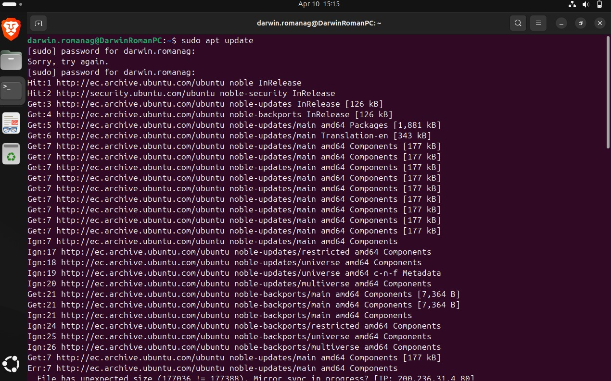
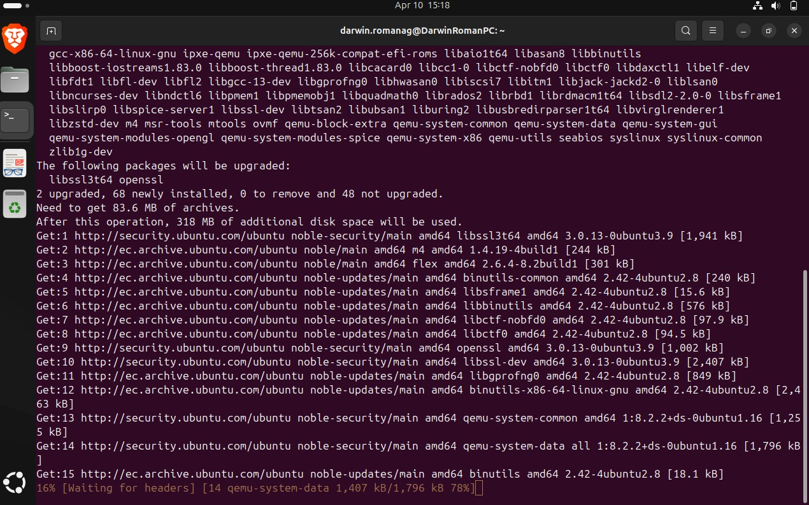
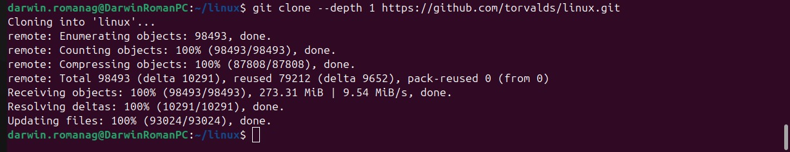
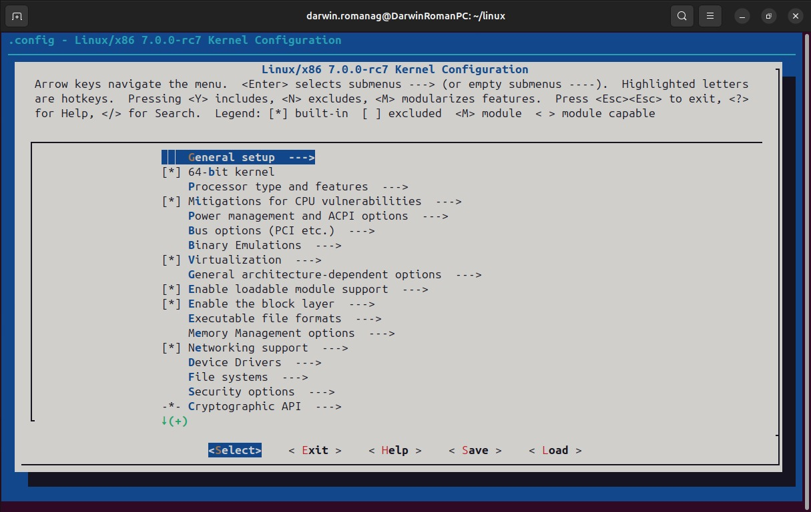

# UNIX-02-SIN-C-Mar-Jul-2026-
Repo for intro to UNIX

# Ejecución del comando: sudo apt update

# Ejecución del comando: sudo apt install -y git vim make gcc libncurses-dev flex bison bc \ 
  cpio libelf-dev libssl-dev syslinux dosfstools qemu-system-x86 

# Ejecución del comando:git clone --depth 1 https://github.com/torvalds/linux.git

