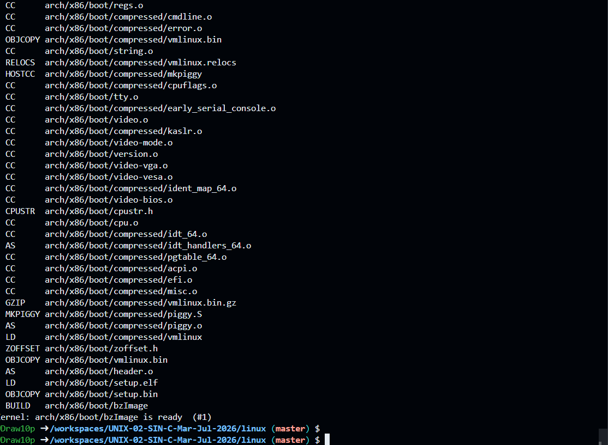
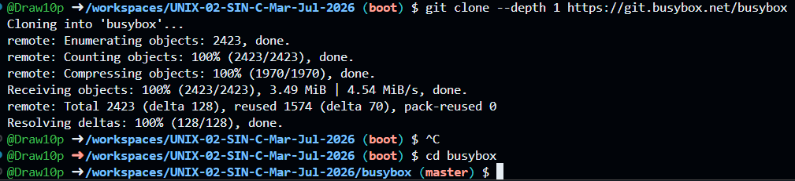
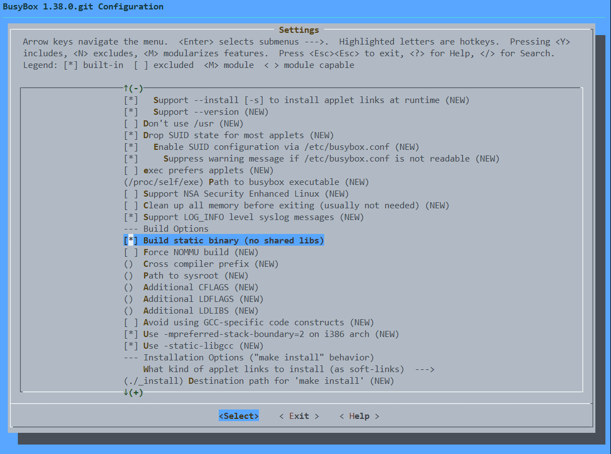
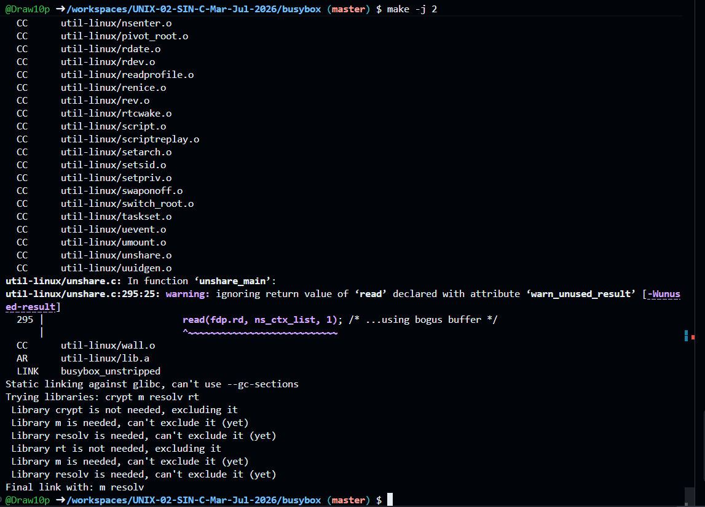
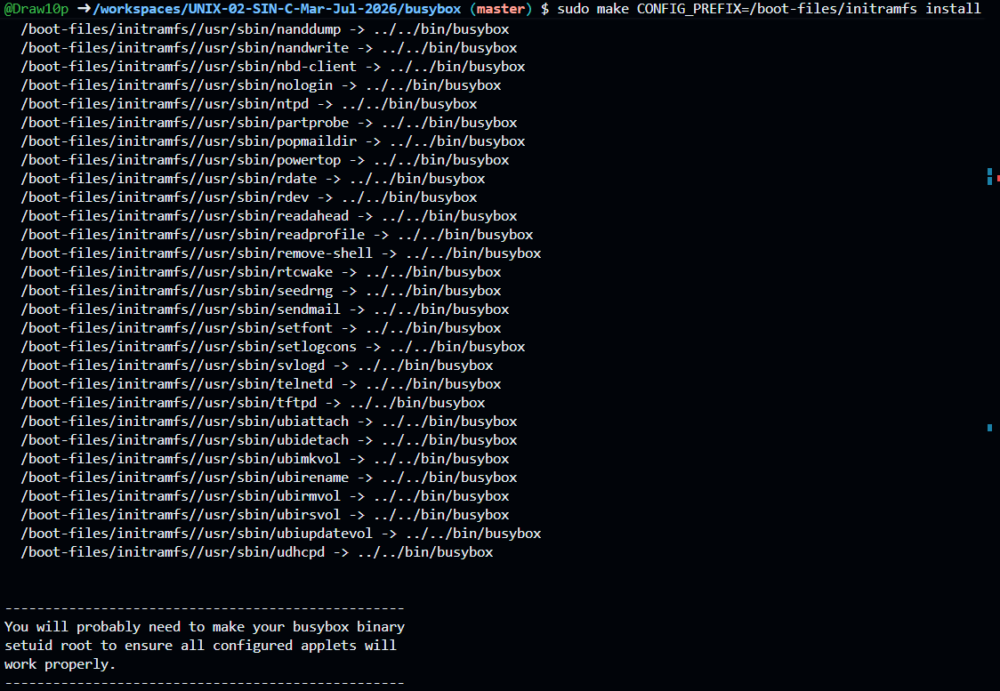
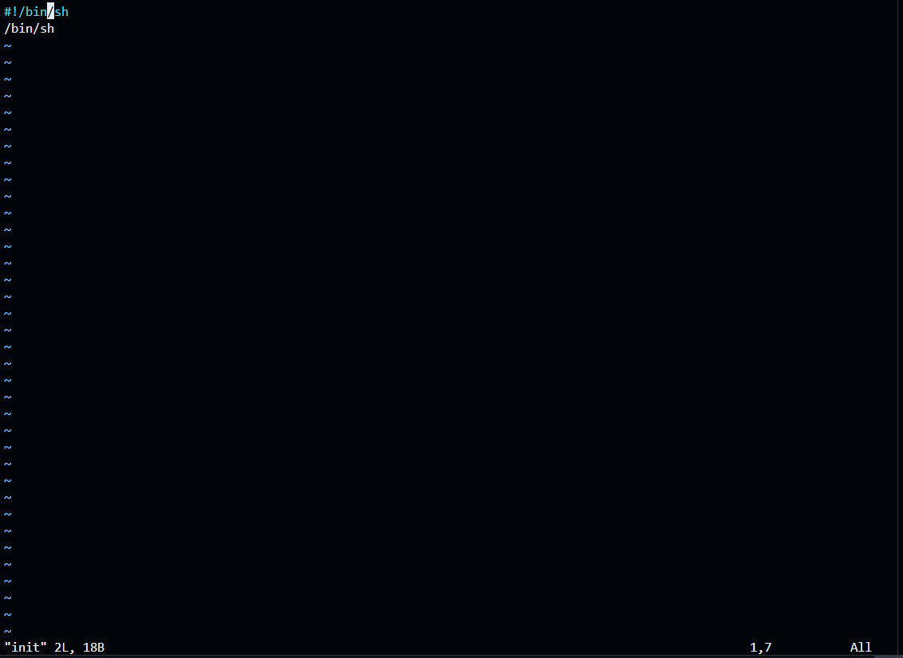
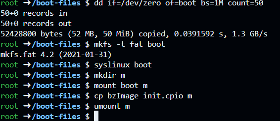
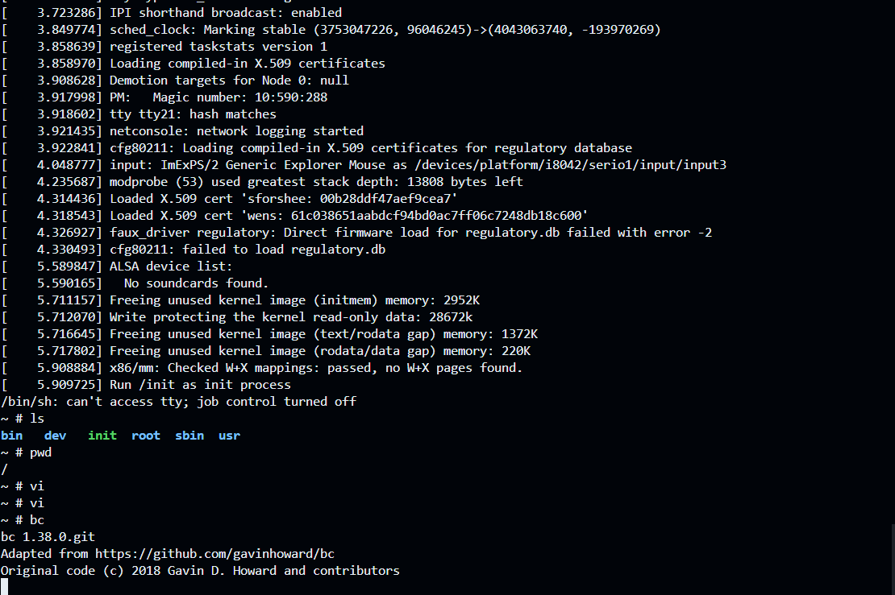
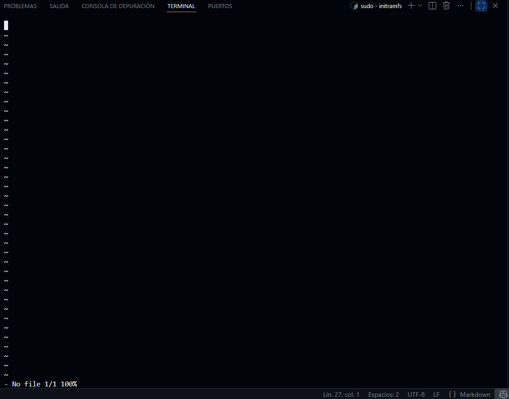

# UNIX-02-SIN-C-Mar-Jul-2026-
Repo for intro to UNIX

# Run the command: sudo apt update

# Execute the following command: sudo apt install -y git vim make gcc libncurses-dev flex bison bc \ 
  cpio libelf-dev libssl-dev syslinux dosfstools qemu-system-x86 

# Run the following command: git clone --depth 1 https://github.com/torvalds/linux.git

# Interactive Linux Menu

# Compiling the Linux kernel

# Compile BusyBox

# Configure BusyBox

# Compiling Changes to BusyBox

# Installing the initramfs directory

# Creating and editing the init file

# Creating the boot image

# Running QEMU and commands

